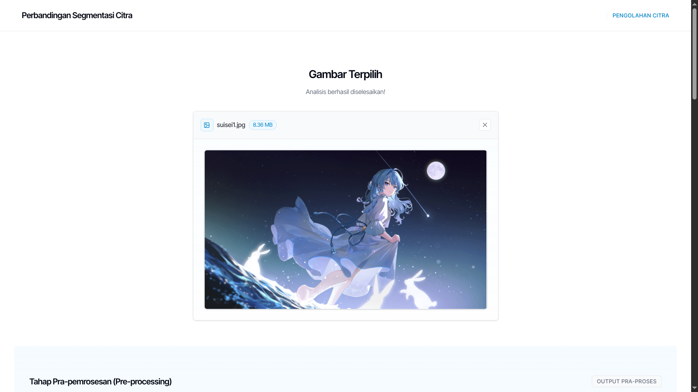
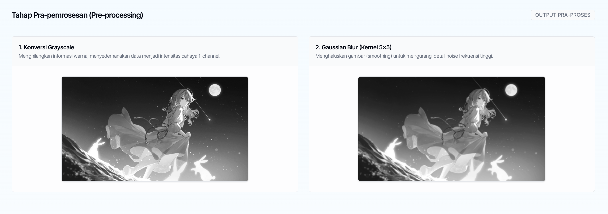
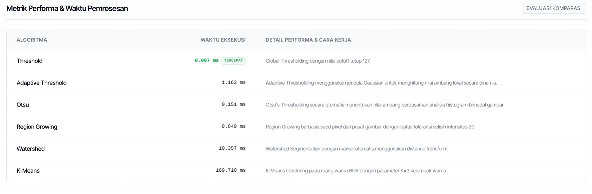
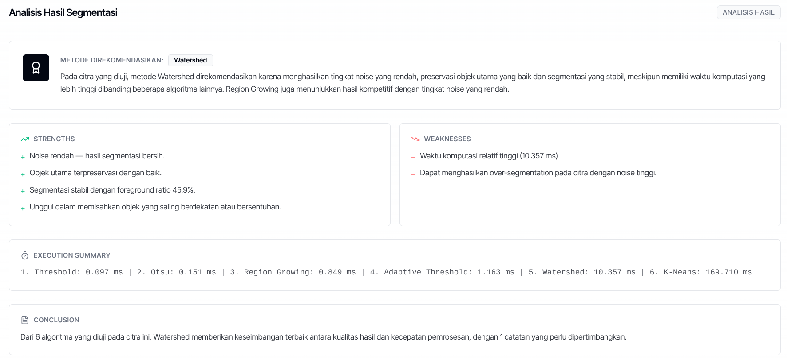

# Pembanding Algoritma Segmentasi Citra

Aplikasi berbasis web untuk melakukan segmentasi citra digital secara komparatif menggunakan 6 algoritma klasik. Sistem ini dirancang untuk memproses, membandingkan, dan menganalisis performa segmentasi secara langsung.

Sistem dibangun menggunakan arsitektur modern yang memisahkan frontend (Next.js + Bun) dan backend (FastAPI + Python), serta dapat dijalankan menggunakan kontainer Docker Compose maupun secara mandiri di sistem lokal (host).

---

## Latar Belakang Proyek

Proyek ini dibangun untuk memenuhi tugas besar mata kuliah **Pengolahan Citra** dengan ketentuan spesifikasi sebagai berikut:

*   **Topik**: Segmentasi Citra
*   **Algoritma Segmentasi** (Minimal 5 algoritma):
    1.  Thresholding & Adaptive Thresholding
    2.  Otsu's Thresholding
    3.  Region Growing
    4.  Watershed Segmentation
    5.  K-Means Clustering
*   **Alur Pemrosesan Sistem**:
    `Input Citra` -> `Pre-processing` -> `Segmentasi` -> `Output Hasil` -> `Perbandingan Hasil` -> `Analisis Akurasi`

Sistem ini memenuhi seluruh kriteria tersebut secara penuh dengan menyediakan pratinjau pemrosesan langkah demi langkah (*step-by-step*) beserta analisis rekomendasi metode terbaik berdasarkan karakteristik gambar.

---

## Pratinjau Antarmuka

Berikut adalah dokumentasi tampilan visual aplikasi:

### 1. Gambar Terpilih


### 2. Tahap Pra-pemrosesan (Grayscale & Gaussian Blur)


### 3. Hasil Segmentasi (Perbandingan 6 Algoritma)


### 4. Metrik Performa & Waktu Pemrosesan


### 5. Analisis Hasil Segmentasi


---

## Cara Menjalankan Menggunakan Docker Compose

Metode ini direkomendasikan karena seluruh ketergantungan sistem (*dependency*) seperti Node.js/Bun, Python, dan Nginx sudah terisolasi di dalam kontainer.

### 1. Klon Repositori dan Masuk ke Direktori
```bash
git clone https://github.com/Ijon6k/segmentationpc.git
cd segmentationpc
```

### 2. Jalankan Kontainer
```bash
docker compose up -d --build --force-recreate
```

### 3. Akses Aplikasi
Buka browser dan akses alamat berikut:
```
http://localhost:3333/
```

Untuk menghentikan kontainer, jalankan:
```bash
docker compose down
```

---

## Cara Menjalankan Secara Terpisah (Tanpa Docker)

Jika Anda ingin melakukan pengembangan atau menjalankan backend dan frontend secara mandiri di luar kontainer Docker, ikuti langkah berikut.

### Prasyarat Lokal
*   Python 3.12 atau 3.13 terinstal di sistem Anda.
*   Node.js (versi 18+) atau Bun terinstal di sistem Anda.

### A. Menjalankan Backend (FastAPI)

Backend FastAPI berfungsi untuk memproses manipulasi gambar melalui pustaka OpenCV dan mengembalikan data dalam bentuk Base64 beserta metrik performanya.

1.  Masuk ke direktori backend:
    ```bash
    cd backend
    ```

2.  Buat virtual environment Python dan aktifkan:
    ```bash
    # Di Linux / macOS:
    python3 -m venv venv
    source venv/bin/activate

    # Di Windows (Command Prompt):
    python -m venv venv
    venv\Scripts\activate
    ```

3.  Instal seluruh library yang diperlukan:
    ```bash
    pip install -r requirements.txt
    ```

4.  Jalankan server pengembangan FastAPI menggunakan Uvicorn:
    ```bash
    uvicorn app.main:app --host 127.0.0.1 --port 8000 --reload
    ```
    *API lokal sekarang aktif di `http://127.0.0.1:8000`.*

### B. Menjalankan Frontend (Next.js)

Frontend Next.js dibangun menggunakan TypeScript dan Tailwind CSS untuk menyajikan antarmuka visual yang responsif.

1.  Buka terminal baru, masuk ke direktori frontend:
    ```bash
    cd frontend
    ```

2.  Instal dependensi Node/Bun:
    ```bash
    # Menggunakan Bun (direkomendasikan):
    bun install

    # Atau menggunakan npm:
    npm install
    ```

3.  Buat konfigurasi environment variable agar frontend mengarah ke server API FastAPI lokal (bukan ke proxy Nginx):
    ```bash
    # Buat file baru bernama .env.local di dalam folder frontend/
    # Isi file dengan baris berikut:
    NEXT_PUBLIC_API_BASE=http://127.0.0.1:8000/api
    ```

4.  Jalankan server pengembangan Next.js:
    ```bash
    # Menggunakan Bun:
    bun run dev

    # Atau menggunakan npm:
    npm run dev
    ```
    *Akses frontend melalui browser di `http://localhost:3000`.*
